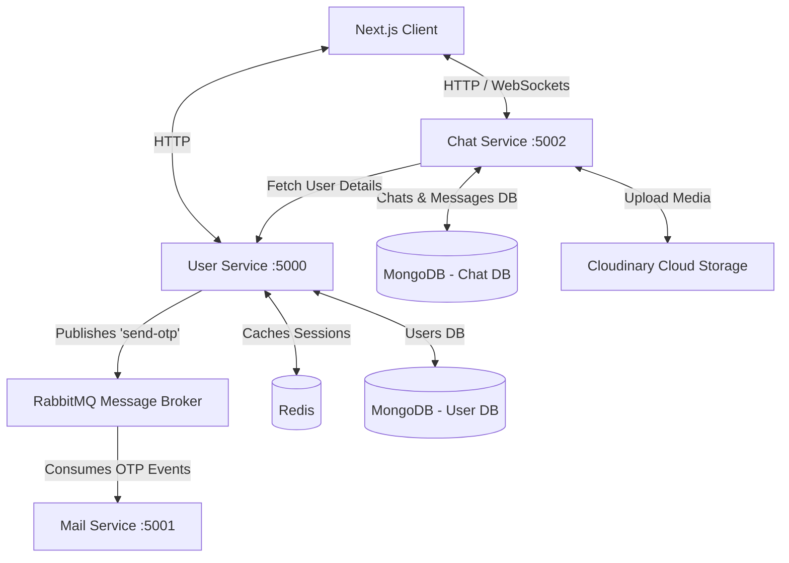

# Real-Time Microservices Chat Application

A premium, high-performance real-time chat application built on a modern **microservices architecture** using Node.js, Express, TypeScript, RabbitMQ, Redis, MongoDB, Next.js, and Socket.io.

---

## 🏗️ Architecture Overview

The system is decoupled into three backend services and a Next.js frontend client:



### Decoupled Services
1. **[User Service](file:///c:/Users/prash/OneDrive/Documents/projects/chatapp/backend/user)** (Port `5000`):
   - Manages user profiles, authentication, and user lookups.
   - Employs **Redis** for authentication session caching.
   - Generates passwordless login OTPs and publishes email jobs to **RabbitMQ** under the `send-otp` queue.
2. **[Mail Service](file:///c:/Users/prash/OneDrive/Documents/projects/chatapp/backend/mail)** (Port `5001`):
   - An asynchronous queue worker service.
   - Consumes messages from RabbitMQ and dispatches email notifications (OTPs) to users using **Nodemailer** through SMTP.
3. **[Chat Service](file:///c:/Users/prash/OneDrive/Documents/projects/chatapp/backend/chat)** (Port `5002`):
   - Responsible for room management, persisting messages, and real-time Socket.io connections.
   - Leverages **Multer** and **Cloudinary** to support photo/media message attachments.
   - Directly triggers live WebSocket events for typing, messaging, and read receipts.
4. **[Frontend Client](file:///c:/Users/prash/OneDrive/Documents/projects/chatapp/frontend)** (Port `3000`):
   - Built on **Next.js 16** (React 19) and styled using **Tailwind CSS v4**.
   - Integrates state and socket context modules to handle authentication states and real-time socket events natively.

---

## ⚡ Key Features

- **Passwordless OTP Auth**: Users log in securely with their email address. The backend issues an OTP which is dispatched asynchronously via RabbitMQ to the Mail Service worker.
- **Real-Time Messaging**: Driven by Socket.io, supporting text messaging and immediate receipt deliveries.
- **Image Attachments**: Integrates Cloudinary API to allow users to attach images to chat rooms dynamically.
- **Typing Indicators**: Displays real-time indicators when a user is typing inside an active chat.
- **Seen Receipts**: Real-time read/seen receipt updates when the counterparty views messages in the chat window.
- **Online Presence**: Dynamic list displaying currently online/active users using socket handshakes.
- **Decoupled Databases**: Independent databases for the User domain and Chat/Message domain, allowing services to scale independently.

---

## 🛠️ Technology Stack

| Layer | Technologies |
| :--- | :--- |
| **Frontend** | Next.js 16 (App Router), React 19, Tailwind CSS v4, Socket.io Client, Axios, React Hot Toast, Lucide Icons |
| **Backend Framework** | Node.js, Express 5, TypeScript, Nodemon, Concurrently |
| **Databases & Cache** | MongoDB (Mongoose), Redis (Upstash/Self-hosted) |
| **Messaging & Queues** | RabbitMQ (amqplib) |
| **Media Storage** | Cloudinary, Multer |
| **Mailing Service** | Nodemailer |

---


## 🚀 Getting Started

### Prerequisites
Make sure you have the following installed:
- Node.js (v18+)
- MongoDB (Local or Atlas instance)
- Redis (Local or Cloud instance e.g., Upstash)
- RabbitMQ server running locally or hosted

### Step-by-Step Launch

#### 1. Setup Infrastructure
Ensure MongoDB, Redis, and RabbitMQ are running. If running RabbitMQ locally, ensure you have enabled the management plugin if required.

#### 2. Start Backend Services
For each backend service, run `npm install` followed by `npm run dev`.

```bash
# In backend/user
cd backend/user
npm install
npm run dev

# In backend/chat
cd ../chat
npm install
npm run dev

# In backend/mail
cd ../mail
npm install
npm run dev
```

#### 3. Start Frontend App
Install the client dependencies and boot up the Next.js dev server:

```bash
cd ../../frontend
npm install
npm run dev
```


